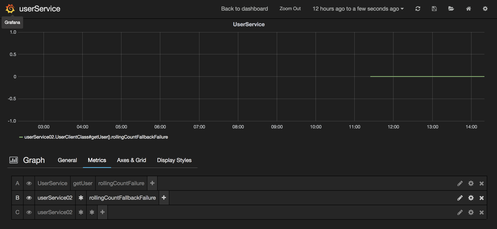

# 1. Hystrix


## configuration - application.yml 수정  
```yml
hystrix:
    threadpool:
    default:
        coreSize: 100  # Hystrix Thread Pool default size
        maximumSize: 500  # Hystrix Thread Pool default size
        keepAliveTimeMinutes: 1
        allowMaximumSizeToDivergeFromCoreSize: true
    command:
    default:
        execution:
        isolation:
            thread:
            timeoutInMilliseconds: 1800000     #설정 시간동안 처리 지연발생시 timeout and 설정한 fallback 로직 수행
        circuitBreaker:
        requestVolumeThreshold: 2            #설정수 만큼 처리가 지연될시 circuit open
        errorThresholdPercentage: 50
        enabled: true
```

## 1. Fallback 처리를 위한 Provider 등록
```java
@EnableZuulProxy
@EnableDiscoveryClient
@SpringBootApplication
public class CoeZuulApplication {

    public static void main(String[] args) {
    SpringApplication.run(CoeZuulApplication.class, args);
    }

    @Bean
    public FallbackProvider zuulFallbackProvider() {
    return new ZuulFallbackProvider();
    }
}
```
### routeFallbackProvider 예시
```java
public class ZuulFallbackProvider implements FallbackProvider {
    private static final String SERVICE_ID = "serviceId";
    private static final String REQUEST_URI = "requestURI";
    @Value("${hystrix.command.default.execution.isolation.thread.timeoutInMilliseconds}")
    private String hystrixThreadTimeoutMilliseconds;
    @Override
    public String getRoute() {return "*";}
    @Override
    public ClientHttpResponse fallbackResponse(String route, Throwable cause) {
        if (cause instanceof HystrixTimeoutException) {
            return response(HttpStatus.GATEWAY_TIMEOUT, getInvalidParam(cause), getRootCauseMsg(cause));
        } else {
            return response(HttpStatus.INTERNAL_SERVER_ERROR, getInvalidParam(cause), getRootCauseMsg(cause));
        }
    }
    private ClientHttpResponse response(HttpStatus status, String invalidParam, String rootCauseMsg) {
        return new ClientHttpResponse() {
            @Override
            public HttpStatus getStatusCode() { return status; }
            @Override
            public int getRawStatusCode() {return status.value();}
            @Override
            public String getStatusText() {return status.getReasonPhrase();}
            @Override
            public void close() { }
            @Override
            public InputStream getBody() {
                HttpStatus status = getStatusCode();
                ErrorResponseBodyVO responseBodyVO;
                if (status == HttpStatus.GATEWAY_TIMEOUT) {
                    responseBodyVO = new ErrorResponseBodyVO("Error"
                                            , "Failed to handle the request in given thread time. (" + rootCauseMsg + ")"
                                            , invalidParam);
                } else if (status == HttpStatus.INTERNAL_SERVER_ERROR) {
                    responseBodyVO = new ErrorResponseBodyVO("Error"
                                            , "Service Unavailable. Please try after sometime. (" + rootCauseMsg + ")"
                                            , invalidParam);
                } else {
                    responseBodyVO = new ErrorResponseBodyVO();
                }
                return new ByteArrayInputStream(responseBodyVO.toJSONString().getBytes());
            }
            @Override
            public HttpHeaders getHeaders() {
                HttpHeaders headers = new HttpHeaders();
                headers.setContentType(MediaType.APPLICATION_JSON);
                return headers;
            }
        };
    }

    private String getInvalidParam(final Throwable cause) {
        if (cause instanceof HystrixTimeoutException) {
            return "hystrix....timeoutInMilliseconds: " + hystrixThreadTimeoutMilliseconds;
        } else {
            RequestContext context = RequestContext.getCurrentContext();
            String serviceId = context.get(SERVICE_ID).toString().toUpperCase();
            String requestURI = context.get(REQUEST_URI).toString();
            return serviceId + requestURI;
        }
    }

    private String getRootCauseMsg(final Throwable cause) {
        return ExceptionUtils.getRootCauseMessage(cause);
    }


}
```
    
## 2. HystrixCommand, fallbackMethod 등록(Service, Component만 사용 가능)
### Hystrix dependency 추가
```xml
<dependency>
    <groupId>org.springframework.cloud</groupId>
    <artifactId>spring-cloud-starter-hystrix</artifactId>
    <version>1.4.4.RELEASE</version>
</dependency>
```        
### HystrixCommand 정의
```java
@Service
public class OrderService {
    private CustomerClient customerClient;
    public OrderService(CustomerClient customerClient) {this.customerClient = customerClient; }

    @HystrixCommand(fallbackMethod = "getDefaultAllCustomer")   
    public List<Customer> getAllCustomer() { return customerClient.findAll();
    }

    public List<Customer> getDefaultAllCustomer() {
        Customer customer = new Customer();
        customer.setCustomerId(Integer.MAX_VALUE);
        customer.setName("fallback");
        customer.setEmail("fallback@gmail.com");

        return Arrays.asList(customer);
    }
}
```
### Application annotation 추가
```java
@EnableHystrix 
@EnableFeignClients
@EnableDiscoveryClient
@SpringBootApplication
@RestController
public class Service01Application {

    public static void main(String[] args) {
        SpringApplication.run(Service01Application.class, args);
    }

    @RequestMapping("/test")
    public String getTest(){
        return "test";
    }
}
```

## 3. FeignClient Hystrix의 fallback class사용
Feign dependency 에 hystrix가 기본 포함 되어 별도 dependency추가 불필요
### Feign Hystrix 정의
```java
@RefreshScope
@FeignClient(
        name ="${coe.application.customer-service}",
        decode404 = true,
        fallback = CustomerFallback.class   //fallback 클래스 정의
)
public interface CustomerClient {
    @RequestMapping(method = RequestMethod.GET, value = API_V1_BASE_PATH + "/customers")
    List<Customer> findAll();
}
```
### Fallback class 정의
```java
@Component
public class CustomerFallback implements CustomerClient {
    @Override
    public List<Customer> findAll() {

        return Arrays.asList(new Customer(1,"coe", "coe@mail.com"));
    }
}
```

# 2. Hystrix Dashboard
Hystrix stream을 시각화하는 서비스

### Hystrix Dashboard dependency 추가
```xml
<dependency>
    <groupId>org.springframework.cloud</groupId>
    <artifactId>spring-cloud-starter-hystrix-dashboard</artifactId>
    <version>1.4.4.RELEASE</version>
</dependency>
```
### Application annotation 추가
```java
@EnableHystrixDashboard
@SpringBootApplication
public class HystrixDashboardApplication {
	public static void main(String[] args) {springApplication.run(HystrixDashboardApplication.class, args);	}
}
```
### Client 서비스의 actuator hystrix stream endpoint 열기 위한 config 추가
> Actuator dependency가 client 서비스에 포함되어 있어야 함
```yml
management:
  endpoints:
    web:
      exposure:
        include: 'hystrix.stream'
```
> Hystrix dashboard 기본 endpoint -> http://localhost:port/hystrix  


main에 hystrix stream URL 입력 후 Monitor Stream 클릭 하면 아래화면 처럼 모니터링 가능


# 3. Hystrix Turbine
각 서비스별 Hystrix Stream 을 통합해주는 서비스
> turbine 기본 endpoint -> http://localhost:port/turbine.stream
### turbine denpendencies 추가
```xml
<dependency>
    <groupId>org.springframework.cloud</groupId>
    <artifactId>spring-cloud-starter-netflix-turbine</artifactId>
</dependency>
```
### Turbine config
```yml
turbine:
  appConfig: productService,userService    # 모니터 원하는 서비스 나열(eureka에 등록되어 있어야 함)
  clusterNameExpression: new String('default')    #default cluster를 사용하겠다고 정의
```
### Application annotation 추가
```java
@EnableTurbine
@EnableDiscoveryClient
@SpringBootApplication
public class TurbinServiceApplication {
	public static void main(String[] args) {SpringApplication.run(TurbinServiceApplication.class, args);}
}
```
# 4. Graphite + Grafana
실시간으로 생성되는 Hystrix Stream 데이터를 historical하게 볼수 있도록 함  
Metrics를 dropwizard로 보내고 이를 graphite에 저장하는 형식으로 시스템 부하에 대한 모니터링 필요
* Graphite: Hystrix Merixs 정보를 파일 형태로 저장
* Grafana: Graphite의 Metrics 이력을 챠트로 표현해 줌(Graphite외 다른 저장소 사용 가능)

> 예제에 사용된 Graphite + Grafana 이미지(choopooly/grafana-graphite)  
> docker run -d -p 8070:80 -p 2003:2003 -p 8125:8125/udp -p 8126:8126 --name grafana-dashboard choopooly/grafana_graphite  
> Metrics 저장소 상황에 따라 local에 volume 매핑 필요 (기본 /var/lib/graphite/storage/whisper)  

### Metrics 전송을 위한 dependencies 추가
```xml
<dependency>
    <groupId>io.dropwizard.metrics</groupId>
    <artifactId>metrics-graphite</artifactId>
    <version>3.1.0</version>
</dependency>
<dependency>
    <groupId>io.dropwizard.metrics</groupId>
    <artifactId>metrics-core</artifactId>
    <version>3.1.0</version>
</dependency>
<dependency>        <!-- hystrix metrics를 dropwizard로 publishing 하기 위해 필요 -->
    <groupId>com.netflix.hystrix</groupId>
    <artifactId>hystrix-codahale-metrics-publisher</artifactId>
    <version>1.5.12</version>
    <exclusions>
        <exclusion>
            <groupId>com.codahale.metrics</groupId>
            <artifactId>metrics-core</artifactId>
        </exclusion>
    </exclusions>
</dependency>
```
### service에 metrics publish 관련 Bean 등록
```java
@EnableFeignClients
@SpringBootApplication
@EnableHystrix
public class Service01Application {
    @Bean
    public MetricRegistry metricRegistry() {
        return new MetricRegistry();
    }
    @Bean   //metrics 전송 interval 설정 및 초기화
    public GraphiteReporter graphiteReporter(MetricRegistry metricRegistry) {
        final GraphiteReporter reporter = GraphiteReporter
                .forRegistry(metricRegistry)
                .build(graphite());
        reporter.start(1, TimeUnit.SECONDS);
        return reporter;
    }
    @Bean   //Graphite 데이터 취합 endpoints
    GraphiteSender graphite() {
        return new Graphite(new InetSocketAddress("localhost", 2003));
    }
    @Bean   // Hystrix에 publisher instance 등록
    HystrixMetricsPublisher hystrixMetricsPublisher(MetricRegistry metricRegistry) {
        HystrixCodaHaleMetricsPublisher publisher = new HystrixCodaHaleMetricsPublisher(metricRegistry);
        HystrixPlugins.getInstance().registerMetricsPublisher(publisher);
        return publisher;
    }
}
```
### Hystrix metrics 항목을 grafana에서 항목 매핑 하여 챠트 구성

