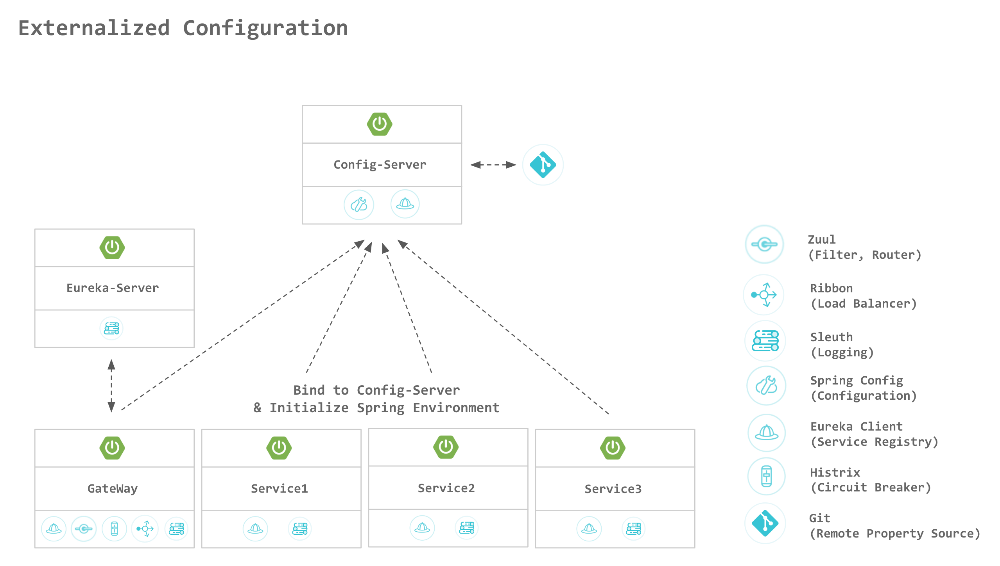

# 1. 개요

Spring Cloud Config는 분산 시스템에서 환경설정을 외부로 분리하여 관리할 수 있는 기능을 제공한다.

Config Server를 사용하여 모든 환경(개발, 테스트, 프로덕션 등)에 대한 어플리케이션들의 속성을 한 곳에서 관리할 수 있다.



### 장점
- 설정 관리의 용이성
- **운영중에 서버 빌드 및 배포 없이 환경설정 변경 가능**


### 기능
Spring Cloud Config Server
- 환경설정(name-value pair, YAML 파일)을 위한 HTTP, 리소스 기반 API
- 속성 값 암호화 및 암호 해독 (대칭 또는 비대칭)
- **@EnableConfigServer** 어노테이션을 사용하여 쉽게 Spring Boot 어플케이션에 적용

Config Client(for Spring Boot 어플리케이션)
- Config Server에 붙어 원격 속성 소스로 Spring 환경 초기화
- 속성 값 암호화 및 암호 해독 (대칭 또는 비대칭)

# 2. 구성방법

### Spring Cloud Config Server 설치방법
1. Spring boot project 생성
2. pom.xml에 dependency추가
	```xml
	<dependency>
		<groupId>org.springframework.cloud</groupId>
		<artifactId>spring-cloud-config-server</artifactId>
	</dependency>
	```

3. configuration - application.yaml 설정
	```yaml
	spring:
	  application:
	    name: {configServiceId}
	  cloud:
	    config:
	      server:
		git:
		  uri: {remote.property.source.uri} # git repository 주소
		  username: {username}
		  password: {password}
	server:
	  port: 8888

	# Eureka(service discovery)를 사용할 경우 아래 설정 추가
	eureka:
	  client:
	    serviceUrl:
	      defaultZone: {eurekaServerUrl}
	    enabled: true
	```

4. Application.java에 @EnableConfigServer 어노테이션 추가
	```java
	@SpringBootApplication
	@EnableDiscoveryClient
	@EnableConfigServer
	public class ConfigApplication {

		public static void main(String[] args) {
			SpringApplication.run(CoeConfigApplication.class, args);
		}
	}
	```

### Spring Cloud Config Client 설치방법
1. pom.xml에 dependency추가
	```xml
	  <dependency>
	      <groupId>org.springframework.cloud</groupId>
	      <artifactId>spring-cloud-config-client</artifactId>
	  </dependency>
	  <!-- Actuator는 변경된 config를 client에서 반영하기 위해 필요함 -->
	  <dependency>
	    <groupId>org.springframework.boot</groupId>
	    <artifactId>spring-boot-starter-actuator</artifactId>
	</dependency>
	```
2. application.yml(또는 properties)등 client의 환경설정은 Remote Property Source(ex. Git)으로 이동 시킴

	Remote Property Source 생성
	> {serviceId}-{profile}.yml 형식으로 환경설정 파일 추가

	

3. Client에 bootstrap.yml 추가
	```yaml
	spring:
	  application:
	    name: {serviceId}  # 서비스 자신의 이름
	  cloud:
	    config:
	      discovery:
		enabled: true
		service-id: {configServiceId} # eureka에 등록된 config service 이름

	eureka:
	  client:
	    serviceUrl:
	      defaultZone: {eurekaServerUrl}
	    enabled: true

	server:
	  port: {port}
	```
	
# 3. Config Refresh 방법
운영 중에 서버 빌드 및 배포 없이 서비스의 환경설정을 변경할 수 있다.
1. 아래 예제와 같이 @RefreshScope 어노테이션을 환결설정 값을 사용하는 모든 클래스에 추가한다
	```java
	@RefreshScope
	@FeignClient(
		name ="${coe.application.customer-service}",
		decode404 = true
	)
	public interface CustomerClient {
	    @RequestMapping(method = RequestMethod.GET, value = API_V1_BASE_PATH + "/customers")
	    List<Customer> findAll();
	}
	```
2. 환경 설정이 변경 된다.
3. Client의 bootstrap.yml에 아래 내용 추가
	```yml
	management:
	  endpoints:
	    web:
	      exposure:
		include: "refresh"
	```
	> 2.0 이하의 경우
	>  yml파일에 management.security.enabled=false 설정 필요
	>  
	> Actuator in Spring Boot 2.0 이상
	> API : /health /info 두개만 기본 open 됨. 따라서 위 설정이 추가 되어야 RefreshScope을 이용할 수 있다. 

4. Remote Property Source의 환경설정 변경 후 http://{serviceUrl}/actuator/refresh POST 호출 함  
  (Actuator in Spring Boot 2.0 이전 버전인 경우 http://{serviceUrl}/refresh)
	> 정상 처리 결과 Body에 아래와 같이 표시되고, 변경 내용이 없다면 아무 내용도 표시되지 않음   
	> 
