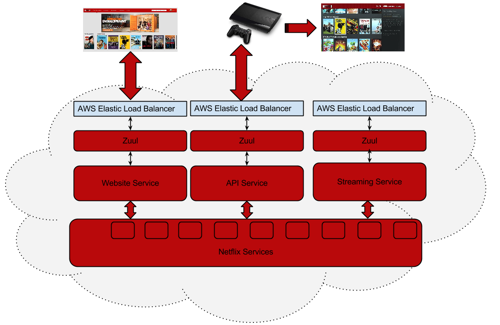
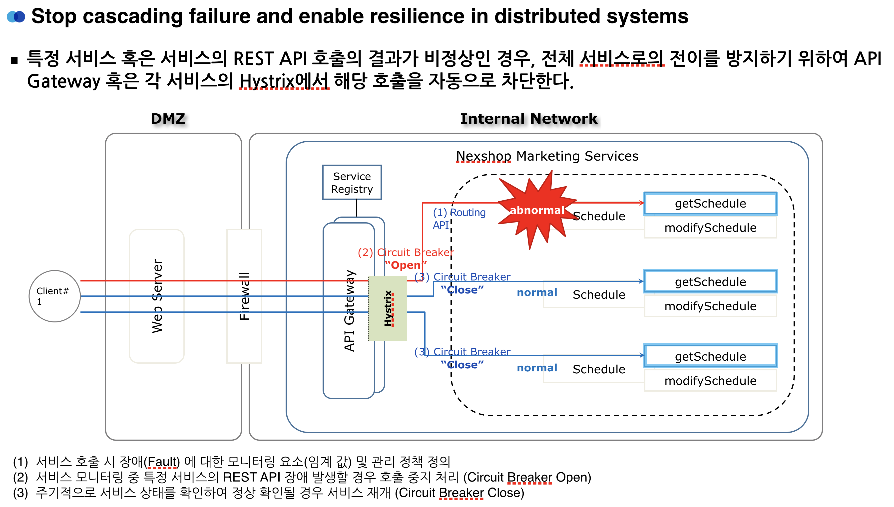

# 1. 개요

### Zuul이란?

Zuul is a JVM-based router and server-side load balancer from Netflix.

```text
Zuul is the front door for all requests from devices and web sites to the backend of
the Netflix streaming application. As an edge service application, Zuul is built to enable
dynamic routing, monitoring, resiliency and security. It also has the ability to route requests
to multiple Amazon Auto Scaling Groups as appropriate.
```

### Zuul 의 기능
- **Dynamic Routing**
- Load Balancing
- Authentication
- Insights
- Stress Testing
- Canary Testing
- Service Migration
- Security
- Static Response handling
- Active/Active traffic management

### Zuul 을 사용하는 이유?
```text
API Gateway는 Microservice Architecture(이하 MSA)에서 언급되는 컴포넌트 중 하나이며,
모든 클라이언트 요청에 대한 end point를 통합하는 서버이다. 마치 프록시 서버처럼 동작한다.
그리고 인증 및 권한, 모니터링, logging 등 추가적인 기능이 있다. 모든 비지니스 로직이 하나의 서버에 존재하는
Monolithic Architecture와 달리 MSA는 도메인별 데이터를 저장하고 도메인별로 하나 이상의 서버가 따로 존재한다.
한 서비스에 한개 이상의 서버가 존재하기 때문에 이 서비스를 사용하는 클라이언트 입장에서는 다수의 end point가 생기게 되며,
end point를 변경이 일어났을때, 관리하기가 힘들기 때문에 Zuul 을 사용하여 관리한다.
```

### Netflix Zuul Architecture


### Zuul 동작


# 2. 구성방법
1. Spring boot project 생성
1. pom.xml에 zuul, eureka-client dependency 추가
    ```xml
    <dependency>
        <groupId>org.springframework.cloud</groupId>
        <artifactId>spring-cloud-starter-netflix-zuul</artifactId>
    </dependency>
    <dependency>
        <groupId>org.springframework.cloud</groupId>
        <artifactId>spring-cloud-starter-netflix-eureka-client</artifactId>
    </dependency>
    ```
1. configuration - application.yml 수정
    ```yaml
    spring:
      application:
        name: zuul-service

    zuul:
      ignoredServices: '*'
      routes:
        customer:
          path: /api/v1/customers/**  
          serviceId: CUSTOMER-SERVICE
          strip-prefix: false
        order:
          path: /api/v1/orders/**
          serviceId: ORDER-SERVIC
          strip-prefix: false        #true인 경우 path를 제거 후 각 서비스에 포워딩

    eureka:
      client:
        serviceUrl:
          defaultZone: http://192.168.1.19:8761/eureka/
        enabled: true
    ```
    - 서비스명 zuul-sevice로 설정
    - Gateway의 라우팅 정보 설정
    - Eureka client 등록
1. @EnableZuulProxy annotation 추가를 통해 Zuul Proxy 선언
    ```java
    @EnableZuulProxy
    @EnableDiscoveryClient
    @SpringBootApplication
    public class CoeZuulApplication {

      public static void main(String[] args) {
        SpringApplication.run(CoeZuulApplication.class, args);
      }
    }
    ```
    - Gateway 도 Eureka Client로 등록
    - Fallback 처리를 위한 Provider 등록
    - Filter 등록

# 3. Router setting

...

# 4. Filter

1. Filter 등록
    ```java
    @EnableZuulProxy
    @EnableDiscoveryClient
    @SpringBootApplication
    public class CoeZuulApplication {

      public static void main(String[] args) {
        SpringApplication.run(CoeZuulApplication.class, args);
      }

      @Bean
      public SimpleFilter simpleFilter() {
        return new SimpleFilter();
      }
    }
    ```

# 5. Hystrix


1. configuration - application.yml 수정
    ```yaml
    ...

    hystrix:
      threadpool:
        default:
          coreSize: 100  # Hystrix Thread Pool default size
          maximumSize: 500  # Hystrix Thread Pool default size
          keepAliveTimeMinutes: 1
          allowMaximumSizeToDivergeFromCoreSize: true
      command:
        default:
          execution:
            isolation:
              thread:
                timeoutInMilliseconds: 1800000     #설정 시간동안 처리 지연발생시 timeout and 설정한 fallback 로직 수행
          circuitBreaker:
            requestVolumeThreshold: 2            #설정수 만큼 처리가 지연될시 circuit open
            errorThresholdPercentage: 50
            enabled: true
    ```
    - Circuit Breaking을 위한 hystrix 설정
1. Fallback 처리를 위한 Provider 등록
    ```java
    @EnableZuulProxy
    @EnableDiscoveryClient
    @SpringBootApplication
    public class CoeZuulApplication {

      public static void main(String[] args) {
        SpringApplication.run(CoeZuulApplication.class, args);
      }

      @Bean
      public FallbackProvider nexshopZuulFallbackProvider() {
        return new ZuulFallbackProvider();
      }
    }
    ```